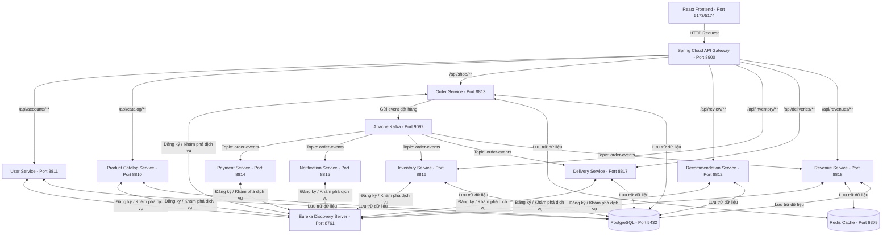

# THÔNG TIN SINH VIÊN

| Thông tin                       | Chi tiết                                 |
| :------------------------------- | :---------------------------------------- |
| **Sinh viên thực hiện** | Nguyễn Tuấn Tài                        |
| **MSSV**                   | 2123110166                                |
| **Lớp**                   | CCQ2311E                                  |
| **Môn học**              | Chuyên đề ứng dụng lập trình WEB 2 |

---

# HỆ THỐNG VI DỊCH VỤ THƯƠNG MẠI ĐIỆN TỬ - MYKINGDOM TOY STORE (MICROSERVICES)

Dự án triển khai kiến trúc **REST Microservices** cho hệ thống cửa hàng đồ chơi trẻ em **MyKingdom Toy Store** nhằm hoàn thành và nâng cao yêu cầu bài tập thực hành **Example 5.02**. Hệ thống sử dụng **Spring Boot**, **Spring Cloud**, **PostgreSQL**, **Redis**, **Apache Kafka**, và **React (Vite)**.

---

## 🏆 Báo Cáo Kết Quả Đạt Được (Đối chiếu Đề bài PDF)

Dự án đã hoàn thành **100%** các yêu cầu được đề ra trong file đề bài [BaiTap_Java-Spring-Boot-Web2-B5NC.pdf](file:///e:/Web2_/docx-TaiLieu/BaiTap_Java-Spring-Boot-Web2-B5NC.pdf) và tích hợp thêm nhiều cải tiến công nghệ hiện đại, cụ thể:

### 1. Đối chiếu tính năng

| Phân hệ / Yêu cầu trong PDF                             |  Trạng thái  | Chi tiết triển khai trong dự án                                                                         |
| :---------------------------------------------------------- | :-------------: | :---------------------------------------------------------------------------------------------------------- |
| **Quản trị (Admin) - Quản lý người dùng**      | ✅ Hoàn thành | Quản lý danh sách tài khoản khách hàng đăng ký trên hệ thống.                                  |
| **Quản trị (Admin) - Quản lý sản phẩm**         | ✅ Hoàn thành | Thêm, sửa, xóa (CRUD) các sản phẩm đồ chơi, tải ảnh, phân mục, cập nhật giá & tồn kho.     |
| **Quản trị (Admin) - Quản lý đặt hàng**        | ✅ Hoàn thành | Theo dõi toàn bộ hóa đơn từ mọi khách hàng, cập nhật trạng thái đơn hàng.                  |
| **Quản trị (Admin) - Quản lý đề xuất**         | ✅ Hoàn thành | Theo dõi và quản lý các đánh giá sản phẩm từ người dùng.                                      |
| **Người dùng (User) - Đăng ký/Đăng nhập**    | ✅ Hoàn thành | Hệ thống đăng ký tài khoản mới, xác thực bằng Token JWT an toàn.                                |
| **Người dùng (User) - Giỏ hàng (Shopping cart)** | ✅ Hoàn thành | Thêm/bớt đồ chơi, cập nhật số lượng, đồng bộ dữ liệu qua bộ nhớ đệm Redis tốc độ cao. |
| **Người dùng (User) - Đặt hàng**                | ✅ Hoàn thành | Quy trình thanh toán nhanh chóng, hiển thị trang lịch sử mua hàng, hóa đơn in ấn.               |
| **Người dùng (User) - Đề xuất sản phẩm**      | ✅ Hoàn thành | Chức năng viết đánh giá, chấm điểm rating 5 sao và hiển thị sản phẩm đề xuất.              |
| **Người dùng (User) - Danh mục sản phẩm**       | ✅ Hoàn thành | Phân loại đồ chơi theo các mục (LEGO, Đồ chơi bé trai, Đồ chơi bé gái, Khuyến mãi).       |

---

## 📌 Kiến Trúc Hệ Thống (Architecture)



---

## 📂 Danh Sách Các Microservices

| Dịch vụ (Service)                          | Cổng (Port) | Cơ sở dữ liệu | Vai trò & Chức năng chính                                                                                                              |
| :------------------------------------------- | :----------: | :----------------: | :----------------------------------------------------------------------------------------------------------------------------------------- |
| **`eureka-server`**                  |   `8761`   |       Không       | **Discovery Server**: Đăng ký và phát hiện địa chỉ động của các dịch vụ.                                              |
| **`api-gateway`**                    |   `8900`   |       Không       | **API Gateway**: Đầu mối nhận request từ Frontend, hỗ trợ CORS, định tuyến và phân tải request qua Eureka.              |
| **`user-service`**                   |   `8811`   |     PostgreSQL     | **Quản lý Tài khoản & Phân quyền**: Đăng ký, Đăng nhập, JWT, quản lý địa chỉ giao hàng và danh sách yêu thích.       |
| **`product-catalog-service`**        |   `8810`   |     PostgreSQL     | **Quản lý Sản phẩm & Giao diện**: Cung cấp danh mục đồ chơi, sản phẩm, banner, menu, và bộ sưu tập.    |
| **`order-service`**                  |   `8813`   | PostgreSQL & Redis | **Quản lý Đơn hàng & Giỏ hàng**: Xử lý giỏ hàng (sử dụng Redis), đặt hàng và gửi sự kiện đặt hàng tới Kafka. |
| **`product-recommendation-service`** |   `8812`   |     PostgreSQL     | **Quản lý Đánh giá & Gợi ý**: Lưu trữ đánh giá sản phẩm và đề xuất cho khách hàng.                               |
| **`payment-service`**                |   `8814`   |       Không       | **Thanh toán**: Tiêu thụ sự kiện `order-events` từ Kafka để thanh toán bất đồng bộ.                                   |
| **`notification-service`**           |   `8815`   |       Không       | **Thông báo**: Tiêu thụ sự kiện từ Kafka gửi email/SMS/WebSocket thông báo khi đặt hàng thành công.                             |
| **`inventory-service`**              |   `8816`   |     PostgreSQL     | **Quản lý Kho**: Theo dõi số lượng tồn kho và cập nhật trừ kho khi có đơn hàng mới thông qua Kafka. |
| **`delivery-service`**               |   `8817`   |     PostgreSQL     | **Quản lý Giao hàng**: Xử lý thông tin vận chuyển, quản lý lộ trình và trạng thái giao nhận đơn hàng. |
| **`revenue-service`**                |   `8818`   | PostgreSQL & Redis | **Quản lý Doanh thu**: Thu thập dữ liệu doanh thu từ đơn hàng, báo cáo thống kê qua bộ nhớ đệm Redis. |

---

## 🌟 Chi Tiết Các Phân Hệ Tính Hệ Thống

### 1. Phân Hệ Người Dùng (User App)

- **Trang chủ & Danh mục**: Hiển thị động danh mục đồ chơi kèm hiệu ứng hover và danh sách sản phẩm nổi bật/khuyến mãi.
- **Quản lý nội dung (Banners, Collections)**: Cung cấp trải nghiệm mua sắm sinh động với các banner quảng cáo và bộ sưu tập sản phẩm mới.
- **Chi tiết sản phẩm**: Xem chi tiết thông số, hình ảnh, mô tả sản phẩm đồ chơi và các đánh giá (rating 5 sao) từ khách hàng khác.
- **Giỏ hàng động (Redis)**: Thêm/bớt sản phẩm, cập nhật số lượng trực tiếp trong giỏ hàng (kết nối trực tiếp với bộ nhớ đệm Redis).
- **Yêu thích (Wishlist)**: Cho phép người dùng lưu lại các sản phẩm quan tâm.
- **Quản lý địa chỉ**: Người dùng có thể lưu nhiều địa chỉ nhận hàng để thanh toán nhanh chóng hơn.
- **Đặt hàng**: Thanh toán nhanh chóng, điền địa chỉ & số điện thoại, theo dõi lộ trình đơn hàng.
- **Lịch sử mua hàng & Chi tiết hóa đơn**: Xem danh sách đơn hàng đã mua, mở Modal xem hóa đơn chi tiết, và cho phép in ấn hóa đơn trực tiếp tại màn hình.
- **Tài khoản**: Đăng ký, đăng nhập và cập nhật hồ sơ cá nhân.

### 2. Phân Hệ Quản Trị (Admin Dashboard)

- **Thống kê tổng quan & Doanh thu**: Dashboard hiển thị nhanh số lượng Sản phẩm, Đơn hàng, Người dùng và báo cáo doanh thu động.
- **Quản lý danh mục & Menu**: Thêm mới, chỉnh sửa và cấu hình hiển thị danh mục, menu trên hệ thống.
- **Quản lý sản phẩm**: Thêm mới đồ chơi, cập nhật giá tiền, số lượng tồn kho, tải ảnh sản phẩm và gán danh mục thông minh.
- **Quản lý Banners & Collections**: Thay đổi banner quảng cáo và cập nhật các bộ sưu tập nổi bật tại trang chủ dễ dàng.
- **Quản lý đơn hàng & Giao hàng**: Xem toàn bộ danh sách hóa đơn từ mọi khách hàng và cập nhật trạng thái đơn hàng và quá trình vận chuyển.
- **Quản lý tài khoản**: Xem danh sách người dùng đã đăng ký tài khoản trên hệ thống.

---

## 🚀 Hướng Dẫn Cài Đặt và Khởi Chạy Hệ Thống

### 📋 Yêu Cầu Chuẩn Bị

1. **Java JDK 21** cài đặt sẵn trên máy và thiết lập biến môi trường `JAVA_HOME`.
2. **Node.js** phiên bản 18+ (để chạy Frontend).
3. **Docker Desktop** (để khởi chạy Redis & Kafka nhanh chóng).
4. **PostgreSQL** đang chạy trên máy (mặc định cổng `5432`).

### 🛠️ Các Bước Thực Hiện

#### Bước 1: Thiết lập Biến môi trường (.env)
* Sao chép file `.env.example` thành `.env` ở thư mục gốc của dự án.
* Chỉnh sửa các thông số (như `DB_PASSWORD`, `JWT_SECRET`, `CLOUDINARY_API_SECRET`) cho phù hợp với môi trường của bạn. Docker và các service sẽ tự động đọc từ file `.env` này.

#### Bước 2: Thiết lập Cơ sở dữ liệu PostgreSQL

* Tạo các database mới trong PostgreSQL tương ứng cho các microservices:
  ```sql
  CREATE DATABASE ecommerce_microservices_db;
  CREATE DATABASE inventory_db;
  CREATE DATABASE delivery_db;
  CREATE DATABASE revenue_db;
  ```
* Thông tin kết nối sẽ được đọc tự động từ biến môi trường `${DB_USERNAME}` và `${DB_PASSWORD}` trong file `.env`. (Mặc định thường là postgres / 123456).

#### Bước 2: Khởi chạy các container bằng Docker

* Di chuyển vào thư mục gốc của dự án (nơi chứa file `docker-compose.yml`) và chạy lệnh sau để khởi động Redis, Kafka và Zookeeper:
  ```bash
  docker-compose up -d
  ```

#### Bước 3: Khởi chạy các dịch vụ Backend Spring Boot

* Sử dụng tập lệnh tự động [run.bat](file:///e:/Web2_/e-commerce-microservices/run.bat) để khởi động toàn bộ **11 services** của backend một cách tự động và dọn dẹp các cổng xung đột:
  ```powershell
  .\run.bat
  ```
* Hoặc chạy thủ công từng service theo thứ tự: `eureka-server` -> `api-gateway` -> các service nghiệp vụ khác (`mvn spring-boot:run` hoặc `mvnw spring-boot:run`).

#### Bước 4: Khởi chạy ứng dụng Frontend (React)

1. Mở cửa sổ terminal mới và di chuyển vào thư mục [frontend](file:///e:/Web2_/e-commerce-microservices/frontend):
   ```bash
   cd e:\Web2_\e-commerce-microservices\frontend
   ```
2. Cài đặt các gói thư viện cần thiết:
   ```bash
   npm install
   ```
3. Khởi chạy dự án ở chế độ phát triển:
   ```bash
   npm run dev
   ```
4. Mở trình duyệt và truy cập theo địa chỉ hiển thị trên terminal (thường là `http://localhost:5173` hoặc `http://localhost:5174`).

### 📚 Tài liệu API (Swagger / OpenAPI)
Sau khi các service khởi động, bạn có thể xem tài liệu API qua giao diện Swagger UI:
- **User Service:** http://localhost:8811/swagger-ui.html
- **Product Catalog Service:** http://localhost:8810/swagger-ui.html
- **Order Service:** http://localhost:8813/swagger-ui.html
- **Inventory Service:** http://localhost:8816/swagger-ui.html
- **Payment Service:** http://localhost:8814/swagger-ui.html
- **Delivery Service:** http://localhost:8817/swagger-ui.html
*(Sử dụng nút Authorize trên Swagger để nhập token JWT dưới dạng Bearer auth)*
