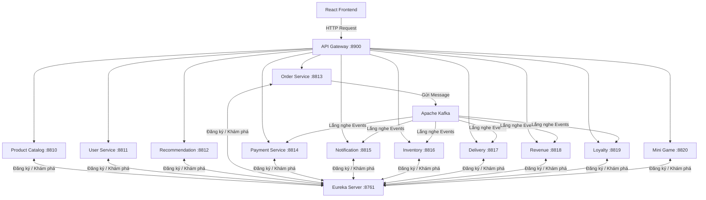

# HỆ THỐNG VI DỊCH VỤ THƯƠNG MẠI ĐIỆN TỬ - MYKINGDOM TOY STORE (MICROSERVICES)

Dự án triển khai kiến trúc **REST Microservices** cho hệ thống cửa hàng đồ chơi trẻ em **MyKingdom Toy Store**. Hệ thống ứng dụng các công nghệ hiện đại bao gồm **Spring Boot**, **Spring Cloud**, **PostgreSQL**, **MongoDB**, **Redis**, **Apache Kafka**, và **React (Vite)**.

---

## 📌 Kiến Trúc Hệ Thống (Architecture)

Hệ thống bao gồm 11 dịch vụ nghiệp vụ (Business Services) độc lập và các dịch vụ hạ tầng, giao tiếp với nhau qua API Gateway và hệ thống Message Broker (Kafka).



---

## 📂 Danh Sách Các Microservices

| Dịch vụ (Service) | Cổng | Cơ sở dữ liệu | Vai trò & Chức năng chính |
| :--- | :---: | :---: | :--- |
| **`eureka-server`** | `8761` | Không | **Discovery Server**: Service Registry, đăng ký và phát hiện địa chỉ động của các dịch vụ. |
| **`api-gateway`** | `8900` | Redis | **API Gateway**: Đầu mối nhận request, xác thực JWT, Rate Limiting (chống spam), và định tuyến. |
| **`product-catalog-service`** | `8810` | PostgreSQL | **Sản phẩm**: Quản lý danh mục đồ chơi, sản phẩm, tải ảnh lên Cloudinary. |
| **`user-service`** | `8811` | PostgreSQL | **Tài khoản**: Đăng ký, Đăng nhập, JWT, OTP quên mật khẩu qua Email, quản lý địa chỉ giao hàng. |
| **`product-recommendation-service`** | `8812` | PostgreSQL/Redis | **Đánh giá & Gợi ý**: Đánh giá sản phẩm và hệ thống đề xuất sản phẩm liên quan. |
| **`order-service`** | `8813` | PostgreSQL/Redis | **Đơn hàng**: Quản lý giỏ hàng (Redis), đặt hàng, điều phối Distributed Transaction (Saga Pattern). |
| **`payment-service`** | `8814` | PostgreSQL | **Thanh toán**: Xử lý thanh toán đơn hàng (nhận sự kiện từ Kafka). |
| **`notification-service`** | `8815` | MongoDB | **Thông báo**: Lưu trữ và gửi thông báo qua Email, Web In-app notification. |
| **`inventory-service`** | `8816` | PostgreSQL | **Kho hàng**: Quản lý tồn kho, trừ kho an toàn khi có đơn đặt hàng thành công. |
| **`delivery-service`** | `8817` | PostgreSQL | **Giao hàng**: Quản lý thông tin vận chuyển, trạng thái giao nhận đơn hàng. |
| **`revenue-service`** | `8818` | PostgreSQL/Redis | **Doanh thu**: Thống kê doanh thu thời gian thực, phục vụ biểu đồ Admin Dashboard. |
| **`loyalty-service`** | `8819` | PostgreSQL/Redis | **Khách hàng thân thiết**: Tích điểm thưởng, đổi Voucher, điểm danh hàng ngày, làm nhiệm vụ. |
| **`mini-game-service`** | `8820` | PostgreSQL/Redis | **Giải trí**: Trò chơi tương tác Lật hình (Memory Match) nhận điểm thưởng. |

---

## 🌟 Tính Năng Nổi Bật

* **Microservices Architecture**: Kiến trúc phân tán, mỗi dịch vụ đảm nhận một nghiệp vụ riêng biệt, dễ dàng mở rộng và bảo trì.
* **Saga Pattern & Outbox Pattern**: Đảm bảo tính nhất quán dữ liệu phân tán (Distributed Transaction) trong quy trình Đặt hàng - Thanh toán - Trừ kho.
* **Event-Driven Architecture**: Sử dụng **Apache Kafka** để giao tiếp bất đồng bộ, giảm độ trễ và tăng khả năng chịu tải.
* **Tối ưu Hiệu suất với Redis**: Caching danh mục sản phẩm, quản lý giỏ hàng với tốc độ mili-giây, Rate Limiting bảo vệ API.
* **Bảo mật Toàn diện**: Spring Security, JWT Authentication tập trung tại API Gateway.
* **Giao diện Hiện đại (UI/UX)**: Ứng dụng Frontend SPA viết bằng ReactJS (Vite), Styled bằng Tailwind CSS, hoạt ảnh mượt mà với Framer Motion.

---

## 🚀 Hướng Dẫn Khởi Chạy Hệ Thống

### 📋 Yêu Cầu Môi Trường
1. **Java JDK 17+** (Khuyên dùng JDK 21).
2. **Node.js 18+** (để chạy Frontend).
3. **Docker Desktop** (để chạy các dịch vụ hạ tầng như Kafka, Redis, MongoDB, PostgreSQL).

### ⚙️ Cấu Hình Ban Đầu
1. Copy file `.env.example` thành `.env` ở thư mục gốc của dự án.
2. Điền các thông tin bảo mật vào file `.env` (Ví dụ: `JWT_SECRET`, `DB_PASSWORD`, thông tin gửi Mail).

### 🐳 Cách 1: Khởi chạy bằng Docker Compose (Khuyến nghị)
Hệ thống hỗ trợ chạy tự động bằng Docker, rất tiện lợi:

```bash
# 1. Build source code Java thành file JAR (bỏ qua Test)
.\build_all.bat

# 2. Khởi động toàn bộ Backend + Hạ tầng (Thêm --profile docker-db nếu không có sẵn PostgreSQL ở local)
docker-compose up -d --build

# 3. Khởi chạy Frontend React
cd frontend
npm install
npm run dev
```

### 💻 Cách 2: Khởi chạy Development (Sử dụng Batch Script)
Nếu muốn chạy trực tiếp code Spring Boot trên máy chủ (host) để tiện debug:

```powershell
# Chạy script tự động (Sẽ dọn dẹp port cũ, bật Docker hạ tầng, và chạy lần lượt 13 services + React)
.\run.bat
```
*(Lưu ý: `run.bat` sẽ mở nhiều cửa sổ CMD cho từng service).*

---

## 🌐 Các Đường Dẫn Truy Cập (URLs)

| Phân hệ / Dịch vụ | URL Truy Cập |
| :--- | :--- |
| **Frontend (Khách hàng & Admin)** | `http://localhost:5173` |
| **API Gateway** | `http://localhost:8900` |
| **Eureka Service Discovery** | `http://localhost:8761` |

### 📚 Tài liệu API (Swagger UI)
Sau khi hệ thống khởi động, bạn có thể xem và test API trực tiếp qua Swagger UI của từng Service (Sử dụng nút *Authorize* để nhập JWT Bearer Token):
* Product Catalog API: `http://localhost:8810/swagger-ui.html`
* User API: `http://localhost:8811/swagger-ui.html`
* Order API: `http://localhost:8813/swagger-ui.html`
* Loyalty API: `http://localhost:8819/swagger-ui.html`
* *(Và tương tự cho các cổng 881x, 882x khác...)*
