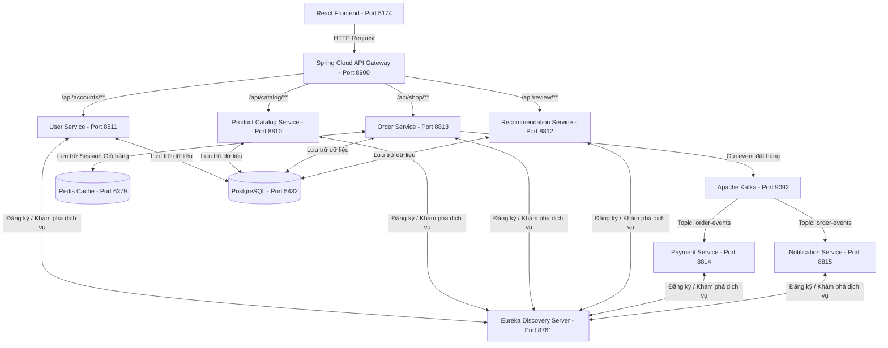

# 
HỆ THỐNG VI DỊCH VỤ THƯƠNG MẠI ĐIỆN TỬ - MYKINGDOM TOY STORE (MICROSERVICES)

Dự án triển khai kiến trúc **REST Microservices** cho hệ thống cửa hàng đồ chơi trẻ em **MyKingdom Toy Store** sử dụng **Spring Boot**, **Spring Cloud** và các dịch vụ phụ trợ như **PostgreSQL**, **Redis**, **Apache Kafka**, cùng với giao diện người dùng xây dựng bằng **React (Vite)**.

---

## 📌 Kiến Trúc Hệ Thống (Architecture)

Hệ thống được thiết kế theo kiến trúc Microservices hướng sự kiện (Event-Driven Architecture) thông qua Apache Kafka và mô hình Service Discovery với Eureka.



---

## 🛠️ Công Nghệ và Công Cụ Sử Dụng

### Backend (Java & Spring Boot Ecosystem)

* **Java 21** & **Spring Boot 3.3.0**
* **Spring Cloud 2023.0.1** (Eureka Service Discovery, Spring Cloud Gateway, OpenFeign)
* **Spring Data JPA** & **Hibernate** (Giao tiếp cơ sở dữ liệu)
* **Spring Validation** (Xác thực dữ liệu đầu vào)
* **JSON Web Token (JWT)** (Bảo mật & Phân quyền)
* **Lombok** (Giảm bớt mã boilerplate)

### Frontend (React App)

* **ReactJS (Vite)**
* **Bootstrap 5 & FontAwesome 6** (Giao diện hiện đại, tối ưu trải nghiệm)
* **Axios** (Kết nối API qua Gateway)
* **Session Isolation** (Cô lập phiên đăng nhập giữa các tab trình duyệt bằng `sessionStorage`)

### Middleware & Database

* **PostgreSQL 15+** (Hệ quản trị CSDL quan hệ lưu trữ thông tin Người dùng, Sản phẩm, Đơn hàng, Đánh giá)
* **Redis** (Lưu trữ và đồng bộ Session/Giỏ hàng)
* **Apache Kafka** & **Zookeeper** (Truyền tải thông điệp/sự kiện bất đồng bộ giữa các dịch vụ)
* **Docker & Docker Compose** (Container hóa và khởi chạy các dịch vụ bổ trợ Redis, Kafka)

---

## 📂 Danh Sách Các Microservices

| Dịch vụ (Service)                          | Cổng (Port) | Cơ sở dữ liệu | Vai trò & Chức năng chính                                                                                                                                          |
| :------------------------------------------- | :----------: | :---------------: | :--------------------------------------------------------------------------------------------------------------------------------------------------------------------- |
| **`eureka-server`**                  |   `8761`   |      Không      | **Discovery Server**: Quản lý đăng ký và phát hiện địa chỉ động của các microservices khác trong hệ thống.                                     |
| **`api-gateway`**                    |   `8900`   |      Không      | **API Gateway**: Đầu mối nhận mọi request từ Frontend, hỗ trợ CORS, định tuyến và phân tải request đến các dịch vụ tương ứng qua Eureka.   |
| **`user-service`**                   |   `8811`   |    PostgreSQL    | **Quản lý Tài khoản & Phân quyền**: Đăng ký, Đăng nhập, lưu thông tin khách hàng, cấp phát và xác thực Token JWT.                           |
| **`product-catalog-service`**        |   `8810`   |    PostgreSQL    | **Quản lý Sản phẩm & Danh mục**: Cung cấp danh mục đồ chơi (LEGO, Robot, Búp bê...) và danh sách sản phẩm. Hỗ trợ CRUD cho Admin.              |
| **`order-service`**                  |   `8813`   | PostgreSQL, Redis | **Quản lý Đơn hàng & Giỏ hàng**: Xử lý giỏ hàng (sử dụng Redis), đặt hàng, lưu thông tin hóa đơn và gửi sự kiện đặt hàng tới Kafka. |
| **`product-recommendation-service`** |   `8812`   |    PostgreSQL    | **Quản lý Đánh giá & Gợi ý**: Lưu trữ đánh giá sản phẩm và đưa ra danh sách sản phẩm đề xuất cho khách hàng.                            |
| **`payment-service`**                |   `8814`   |      Không      | **Thanh toán**: Lắng nghe sự kiện `order-events` từ Kafka để thực hiện xử lý thanh toán bất đồng bộ.                                           |
| **`notification-service`**           |   `8815`   |      Không      | **Thông báo**: Lắng nghe sự kiện `order-events` để gửi thông báo (email/SMS/notification) cho khách hàng khi đặt hàng thành công.             |

---

## 🌟 Các Tính Năng Chính Của Hệ Thống

### 1. Phân Hệ Người Dùng (User App)

* **Xem danh mục & sản phẩm nổi bật**: Trang chủ hiển thị động danh mục đồ chơi kèm hiệu ứng bắt mắt và danh sách sản phẩm bán chạy/khuyến mãi.
* **Tìm kiếm & Lọc sản phẩm**: Xem chi tiết thông số, hình ảnh, mô tả sản phẩm đồ chơi.
* **Quản lý giỏ hàng**: Thêm/bớt sản phẩm, cập nhật số lượng trực tiếp trong giỏ hàng (đồng bộ cache Redis).
* **Đặt hàng & Lịch sử mua hàng**: Thanh toán nhanh chóng, theo dõi trạng thái đơn hàng của cá nhân.
* **Cá nhân hóa tài khoản**: Đăng ký, đăng nhập và chỉnh sửa hồ sơ thông tin cá nhân.

### 2. Phân Hệ Quản Trị (Admin Dashboard)

* **Quản lý danh mục (Category CRUD)**: Thêm mới, chỉnh sửa, xóa danh mục sản phẩm qua giao diện trực quan.
* **Quản lý sản phẩm (Product CRUD)**: Thêm mới đồ chơi, tải ảnh sản phẩm, sửa giá tiền, cập nhật số lượng tồn kho, gán danh mục qua Dropdown thông minh.
* **Quản lý đơn hàng**: Xem danh sách hóa đơn từ mọi khách hàng và cập nhật trạng thái xử lý đơn hàng.
* **Quản lý người dùng**: Theo dõi danh sách tài khoản khách hàng đăng ký trên hệ thống.

### 3. Giải Pháp Nổi Bật về Trải Nghiệm (UX) & Kiến Trúc

* **Session Isolation (Cô lập phiên)**: Chuyển đổi cơ chế lưu trữ token từ `localStorage` sang `sessionStorage` để giải quyết triệt để lỗi ghi đè phiên đăng nhập khi mở nhiều tab trình duyệt (ví dụ: Tab 1 đăng nhập User thường, Tab 2 đăng nhập Admin đồng thời trên cùng một trình duyệt mà không bị đá phiên nhau).
* **Xử lý bất đồng bộ (Event-Driven)**: Tận dụng Kafka để giảm tải cho `order-service`. Khi đặt hàng, đơn hàng được lưu ngay và bắn event sang Kafka, các dịch vụ Payment và Notification sẽ tự động tiêu thụ sự kiện đó để xử lý nghiệp vụ riêng mà không làm nghẽn luồng chính.

---

## 🚀 Hướng Dẫn Cài Đặt và Khởi Chạy Hệ Thống

### 📋 Yêu Cầu Chuẩn Bị

1. **Java JDK 21** cài đặt sẵn trên máy và thiết lập biến môi trường `JAVA_HOME`.
2. **Node.js** phiên bản 18+ (để chạy Frontend).
3. **Docker Desktop** (để khởi chạy Redis & Kafka nhanh chóng).
4. **PostgreSQL** đang chạy trên máy (mặc định cổng `5432`).

### 🛠️ Các Bước Thực Hiện

#### Bước 1: Thiết lập Cơ sở dữ liệu PostgreSQL

* Tạo một database mới tên là `ecommerce_microservices_db` trong PostgreSQL:
  ```sql
  CREATE DATABASE ecommerce_microservices_db;
  ```
* Thông tin cấu hình mặc định trong các file `application.properties`:
  * **Database URL**: `jdbc:postgresql://localhost:5432/ecommerce_microservices_db`
  * **Username**: `postgres`
  * **Password**: `123456` *(Bạn có thể chỉnh sửa password này trong các file application.properties của từng service nếu cần thiết).*

#### Bước 2: Khởi động Redis và Apache Kafka bằng Docker

* Di chuyển vào thư mục gốc của dự án (nơi chứa file `docker-compose.yml`) và chạy lệnh sau để khởi động container Redis, Kafka và Zookeeper:
  ```bash
  docker-compose up -d
  ```
* Kiểm tra trạng thái các container:
  ```bash
  docker ps
  ```

#### Bước 3: Khởi chạy các dịch vụ Backend Spring Boot

Khởi chạy các microservices theo **đúng thứ tự** dưới đây (thông qua IDE Eclipse/IntelliJ hoặc dùng terminal trong thư mục của từng service):

1. **`eureka-server`**: Dịch vụ Service Discovery.

   ```bash
   mvnw spring-boot:run
   ```

   *Kiểm tra trang quản trị Eureka tại địa chỉ: `http://localhost:8761`*
2. **`api-gateway`**: API Gateway định tuyến.

   ```bash
   mvnw spring-boot:run
   ```
3. **Khởi chạy các service nghiệp vụ độc lập** (thứ tự bất kỳ):

   * **`user-service`**
   * **`product-catalog-service`**
   * **`order-service`**
   * **`product-recommendation-service`**
   * **`payment-service`**
   * **`notification-service`**

*Khi tất cả các dịch vụ backend khởi chạy thành công, truy cập giao diện quản trị Eureka (`http://localhost:8761`) để đảm bảo toàn bộ các service đều hiển thị trạng thái `UP` trong danh sách.*

#### Bước 4: Khởi chạy ứng dụng Frontend (React)

1. Mở cửa sổ terminal mới và di chuyển vào thư mục `frontend`:
   ```bash
   cd frontend
   ```
2. Cài đặt các gói thư viện cần thiết:
   ```bash
   npm install
   ```
3. Khởi chạy dự án ở chế độ phát triển:
   ```bash
   npm run dev
   ```
4. Mở trình duyệt và truy cập theo địa chỉ hiển thị trên terminal (thường là `http://localhost:5174` hoặc `http://localhost:5173`).

---
